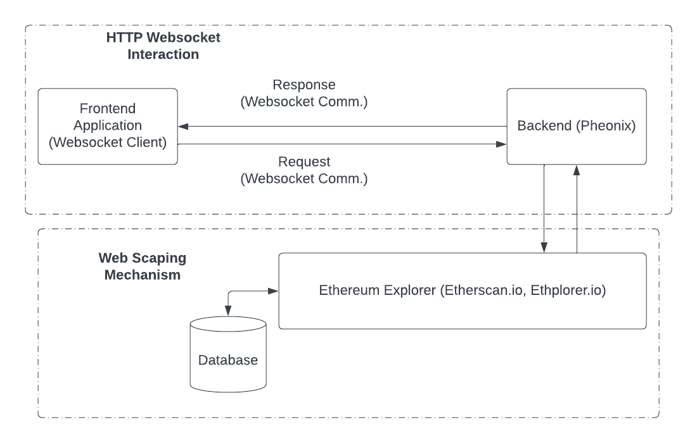
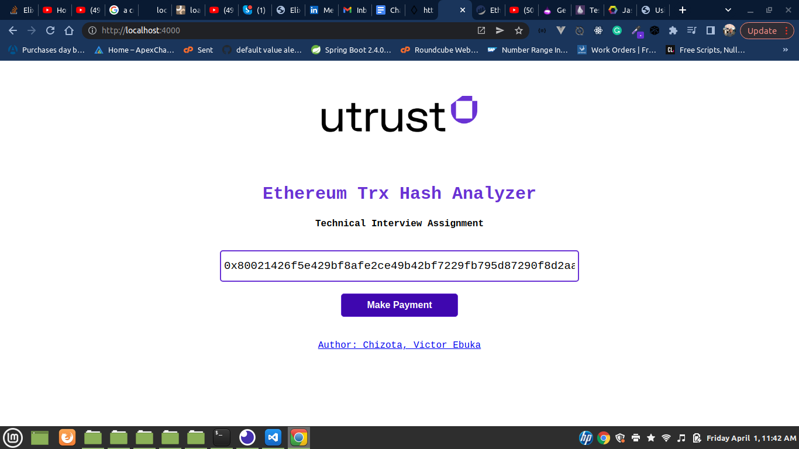
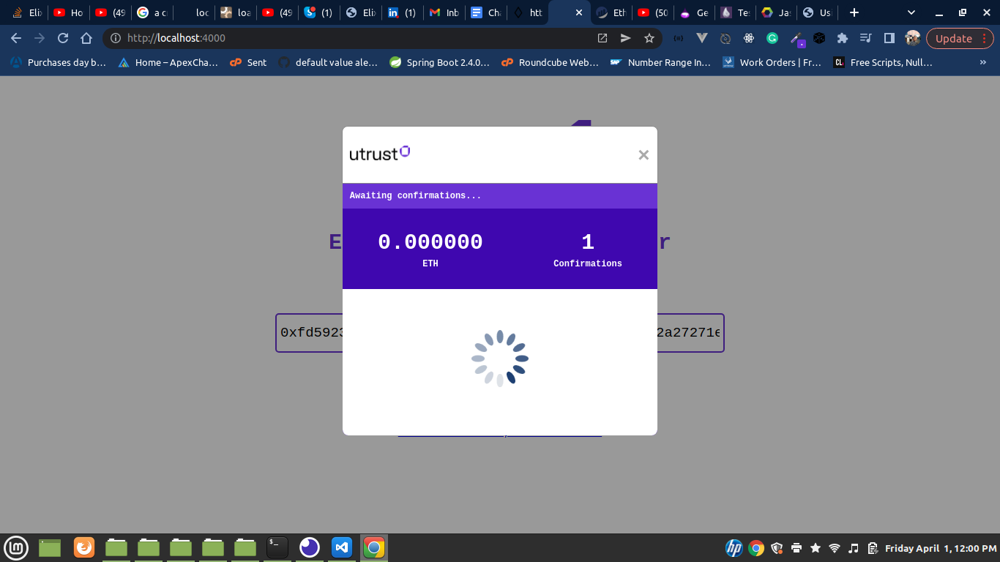
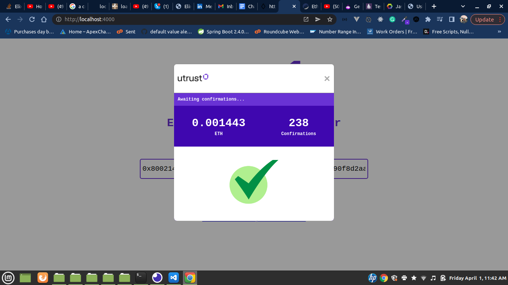

# Ethscan

This project is a solution to the Utrust Fullstack Developer Coding Challenge.

Service Components:

- Frontend Application: This component accepts eth trx hash and forwards it to Phoneix Server via websocket communication.

- Backend Application: This component handles requests coming from the frontend application and generates a proxy request on thirdparty ethereum explorer api.

- Etherscan.io: This is an API service which provides ethereum transaction api for trx hash confirmations.

- System.cmd [Curl], Crawly & Flokli: This libraries where used to setup webscraping on Etherscan.io. The etherscan.io rejects crawly requests due to its header configuration by cloudflare. I implemented Curl with System.cmd to help fetch the htmls, then piped it through Crawly - Floki in order to extract the data (confirmations, and ETH value).

Application Enviroment

- Elxir Compiler
- Phoenix framework

To start your Ethscan server:

- Install dependencies with `mix deps.get`
- Start Ethscan endpoint with `mix phx.server` or inside IEx with `iex -S mix phx.server
- To run the test case: `mix test`
  Now you can visit [`localhost:4000`](http://localhost:4000) from your browser.

System Design:

Results:

- Screen 1:
  

Blockers:

- I initially used Ethplorer.io in place of Etherscan due to availability of the confirmations count on its response object. But there is a problem! It takes about 2-5 confirmations from etherscan.io before the transactino hash will be available on Ethplorer.io. Automatically Ethplorer lags with 2-4 confirmation counts behind etherscan. Not good for business.

- Managing the states on websockets. I was not able to find a way to disconnect server from client apart from timeout, or client channel disconnection `(channel.leave())`. But its fine I will do more research.

- Writing tests with elixier was not that easy - I believe with time I will perfect it.
